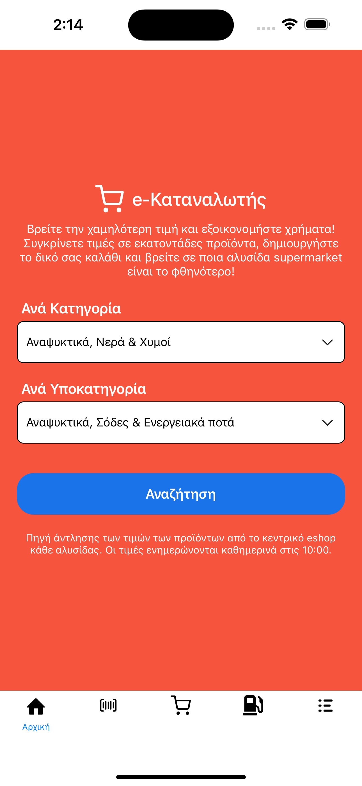
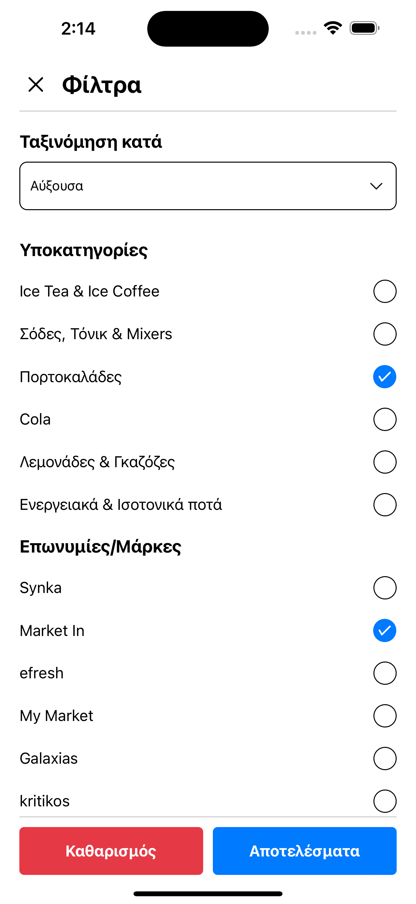

# Expo Router Example

Use [`expo-router`](https://docs.expo.dev/router/introduction/) to build native navigation using files in the `app/` directory.

## 🚀 How to use

```sh
npx create-expo-app -e with-router
```

## 📝 Notes

- [Expo Router: Docs](https://docs.expo.dev/router/introduction/)




