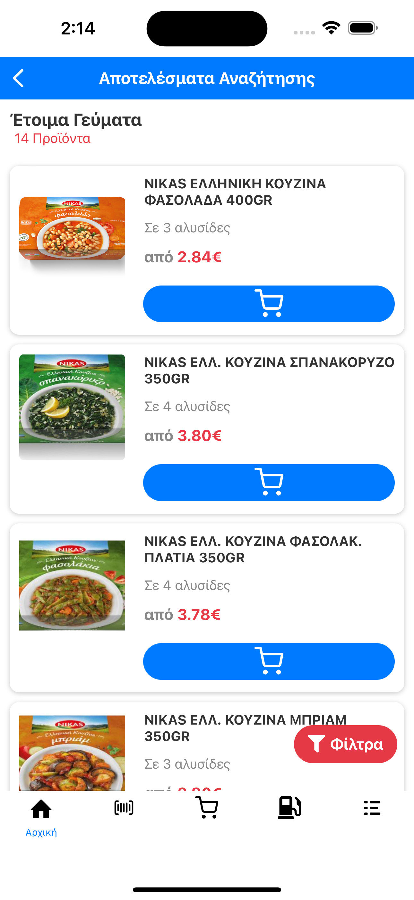

Welcome to the E-Commerce App!

## 🚀 Getting Started

Follow these instructions to set up and run the project on your local machine.

## Prerequisites

Node.js (LTS version recommended)

## Installation

Clone the repository:

git clone https://github.com/paulosvel/e-commerce-app
cd e-commerce-app

Install dependencies:

npm install or yarn

Run the development server:

npx expo start or npm start

## 🖼️ App Images

Here are some screenshots of the app in action:

